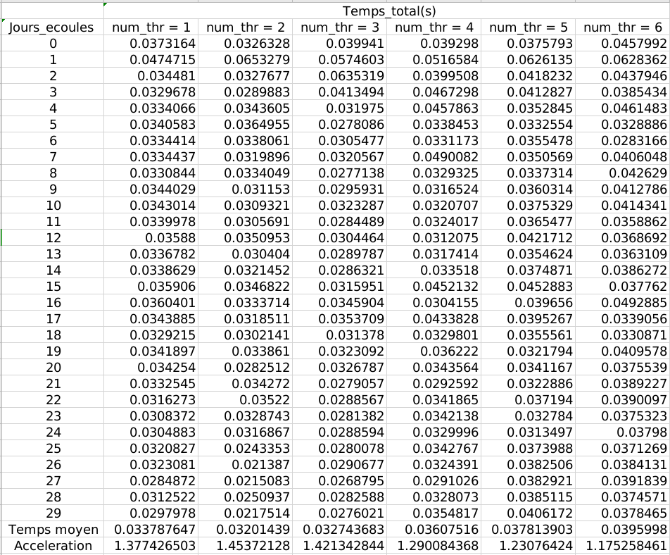

# Projet 

Ziqi MA

## 0. lscpu

Le paramètre de notre cpu est ci-dessous:

```
Architecture:                    x86_64
CPU op-mode(s):                  32-bit, 64-bit
Byte Order:                      Little Endian
Address sizes:                   39 bits physical, 48 bits virtual
CPU(s):                          4
On-line CPU(s) list:             0-3
Thread(s) per core:              2
Core(s) per socket:              2
Socket(s):                       1
NUMA node(s):                    1
Vendor ID:                       GenuineIntel
CPU family:                      6
Model:                           142
Model name:                      Intel(R) Core(TM) i5-7200U CPU @ 2.50GHz
Stepping:                        9
CPU MHz:                         2700.000
CPU max MHz:                     3100,0000
CPU min MHz:                     400,0000
BogoMIPS:                        5399.81
Virtualization:                  VT-x
L1d cache:                       64 KiB
L1i cache:                       64 KiB
L2 cache:                        512 KiB
L3 cache:                        3 MiB
NUMA node0 CPU(s):               0-3
```


## 1. Mesure du temps

Dans l'algorithme, on ajoute les codes pour mesurer du temps.

Dans le console, on tape: 

```bash
$ make simulation.exe

$ ./simulation.exe
```

Les résultats sont dans le ficher `temps_init.dat`, on le copie ci-dessous:


on choisit les premier 30 processus pour calculer le temps moyen.

|       | Temps_sans_affichage | Temps_avec_affichage | Temps_affichage |
| ----- | -------------------- | -------------------- | --------------- |
| Moyen | 0.026909387          | 0.046540357          | 0.01963097      |

Alors, on a constaté que le temps passé pour simuler le statistique est le temps passé à l'affichage sont similaires, donc dans les parties suivantes, on ne pourra pas négliger le temps de l'affichage.


## 2. Parallélisation affichage contre simulation

On ajoute des parties de communication mpi dans le code.

```c++
......       
if (rank ==1){
       		......
            auto const &data_passe = grille.getStatistiques();
            MPI_Send(&jours_ecoules,1,MPI_INT,0,655,MPI_COMM_WORLD);
            MPI_Send(data_passe.data(),3*data_passe.size(),MPI_INT,0,666,MPI_COMM_WORLD);
            
            // Mesure du temps
            end = std::chrono::system_clock::now();
            temps_total = end-start;
            output_temp << jours_ecoules << "\t"<< temps_total.count() << std::endl;
            jours_ecoules += 1;
}
else if (rank == 0 && affiche){
    std::size_t jours_ecoules;
    auto &data_recv = grille.getStatistiques();
    MPI_Recv(&jours_ecoules,1,MPI_INT,1,655,MPI_COMM_WORLD,&status);
    MPI_Recv(data_recv.data(),3*data_recv.size(),MPI_INT,1,666,MPI_COMM_WORLD,&status);
    afficheSimulation(ecran, grille, jours_ecoules);
}
```

et dans le console, on tape:

```bash
$ make simulation_sync_affiche_mpi.exe

$ mpiexec -np 2 ./simulation_sync_affiche_mpi.exe
```

Les resultats sont dans le fichier `temps_sync_affiche_mpi.dat`, on le copie ci-dessous:


on choisit les premier 30 processus pour calculer le temps moyen. le temps moyen pour la simulation est `0.03516`. L'accélération est $S_{syn} = \frac{0.04654}{0.03516} = 1.32$.


## 3. Parallélisation affichage asynchrone contre simulation

On ajoute des parties de `MPI_Iprobe`  dans le code:

```c++
if (rank ==1){            
	while(!flag){
                MPI_Iprobe(0,10,MPI_COMM_WORLD,&flag,&status);
    }
            MPI_Recv(&recv_flag,1,MPI_INT,0,10,MPI_COMM_WORLD,&status);
            MPI_Send(&jours_ecoules,1,MPI_INT,0,655,MPI_COMM_WORLD);
            MPI_Send(data_passe.data(),3*data_passe.size(),MPI_INT,0,666,MPI_COMM_WORLD);
            
            // Mesure du temps
            end = std::chrono::system_clock::now();
            temps_total = end-start;
            output_temp << jours_ecoules << "\t"<< temps_total.count() << std::endl;
            jours_ecoules += 1;
}
else if (rank == 0 && affiche){
    std::size_t jours_ecoules;
    auto &data_recv = grille.getStatistiques();
    int un_flag = 1;
    MPI_Isend(&un_flag,1,MPI_INT,1,10,MPI_COMM_WORLD,&reqs);
    MPI_Recv(&jours_ecoules,1,MPI_INT,1,655,MPI_COMM_WORLD,&status);
    MPI_Recv(data_recv.data(),3*data_recv.size(),MPI_INT,1,666,MPI_COMM_WORLD,&status);
    afficheSimulation(ecran, grille, jours_ecoules);
    MPI_Wait(&reqs, &status);
}
```

et dans le console, on tape:

```bash
$ make simulation_async_affiche_mpi.exe

$ mpiexec -np 2 ./simulation_async_affiche_mpi.exe
```

Les resultats sont dans le fichier `temps_MPI_asynchrone.dat`, on le copie ci-dessous:


on choisit les premier 30 processus pour calculer le temps moyen. le temps moyen pour la simulation est `0.02652`. L'accélération est **$S_{asyn} = \frac{0.04654}{0.02652} = 1.75$**, en comparant avec l'accélération précédente, on a constaté que, la méthode avec `MPI_Iprobe` est plus vite. En fait, ce temps est près égal au temps_sans_affichage dans la question une, donc avec `MPI_Iprobe`, le processu de l'affichage n'influence pas le processu de la simulation.


## 4. Parallélisation OpenMP

#### En prenant un nombre d'individus global constant

On ajoute `# pragma omp parallel for schedule(dynamic)` dans le code, et on ajoute des `bash` documents: `async_omp_glob_cst.sh` dans le dossier.

```bash
#!/bin/bash
for i in $(seq 1 6)
do
    mpiexec -np 2 ./simulation_async_omp.exe $i glob_cst
done
```

pour tester, dans le console, on tape:

```bash
$ make simulation_async_omp.exe 

$ bash async_omp_glob_cst.sh 
```

La courbe de statistuqe est identique que la courbe origin.


Les résultats sont dans les document `temps_async_omp_$(num_thread)_glob_cst.dat`.

On présente le temps des premier 30 processus pour le nombre de thread de 1 à 6 :




Après, on calcule le temps moyen et accélération. 

| num_thread     | 1      | 2      | 3      | 4      | 5      | 6      |
| -------------- | ------ | ------ | ------ | ------ | ------ | ------ |
| Temps moyen(s) | 0.0338 | 0.0320 | 0.0327 | 0.0361 | 0.0378 | 0.0396 |
| Accélération   | 1.3774 | 1.4537 | 1.4213 | 1.2901 | 1.2308 | 1.1753 |

On a constaté alors, quand **le nombre de thread est 2**, la performance est le mieux, car le thread dans chaque core est 2 d'après `lscpu`.

#### En prenant un nombre d'individus constant par thread

On change le code précédent par  `# pragma omp parallel for schedule(static)` , et on ajoute des `bash` documents: `async_omp_indv_cst.sh`dans le folder 

```bash
#!/bin/bash
for i in $(seq 1 6)
do
    mpiexec -np 2 ./simulation_async_omp.exe $i indv_cst
done
```

pour tester, dans le console, on tape:

```bash
$ make simulation_async_omp.exe 

$ bash async_omp_indv_cst.sh 
```

Les résultats sont dans les document `temps_async_omp_$(num_thread)_indv_cst.dat`.

On présente le temps des premier 30 processus pour num_thread de 1 à 6 :


On calcule le temps moyen et accélération. 

| num_thr         | 1      | 2      | 3      | 4      | 5      | 6      |
| --------------- | ------ | ------ | ------ | ------ | ------ | ------ |
| Temps moyen (s) | 0.0336 | 0.0334 | 0.0321 | 0.0347 | 0.0302 | 0.0361 |
| Accélération    | 1.3832 | 1.3951 | 1.4492 | 1.3410 | 1.5398 | 1.2879 |

On a constaté que, quand **le nombre de thread est 5**, la performance est la mieux, mais elle est moins bon que le programme séquentiel (dans la partie 3, l'accélération est 1.75).


## 5. Parallélisation MPI de la simulation

La courbe de statistuqe est identique que la courbe origin.

On utilise `MPI_Comm_split` pour créer un groupe de l’affichage et un groupe de simulation.

La courbe de statistique tracé est identique que la courbe origin.


On ajoute ub `bash` documents: `async_mp.sh`dans le folder pour faciliter le teste. 

```bash
#!/bin/bash
for i in $(seq 1 6)
do
    mpiexec -np $i ./simulation_async_mpi.exe $i
done
```

pour tester, dans le console, on tape:

```bash
$ make simulation_async_omp.exe 

$ bash async_omp_indv_cst.sh 
```

Les résultats sont dans les document `temps_async_mpi_$(num_thread)_thread.dat`.


On choisit les 30 premier jours pour calculer le temps moyen et accélération en variant le nombre de processus de 2 à 8. On a constaté que quand le nombre de processus est grand que 5, le temps de calcul devient trop grand. Donc on juste comparer les nombres de processus de 2 à 5

| num_proc       | 2      | 3      | 4      | 5      |
| -------------- | ------ | ------ | ------ | ------ |
| Temps moyen(s) | 0.0330 | 0.0332 | 0.0354 | 0.1130 |
| Accélération   | 1.4103 | 1.3999 | 1.3161 | 0.4120 |

 On a constaté que quand on choisit **le `num_proc` égal 2**, la performance est le mieux, mais l'accélération est inférieur que l'accélération de la partie 3, ce qui est **1.75**.


### 5.1 Parallélisation finale

on mélange les omp et les mpi, après, on écrit un `async_mpi_omp.sh` pour tester:

```bash
#!/bin/bash
for proc in $(seq 2 3)
do
    for thread in $(seq 1 4)
    do
        mpiexec -np $proc ./simulation_async_mpi_omp.exe $proc $thread
    done
done
```

Dans le console, on tape alors:

```bash
$ make simulation_async_mpi_omp.exe

$ bash async_mpi_omp.sh
```

Les résultats sont dans les documents `temps_async_mpiomp_proc$(num_proc)_thread$(num_thread).dat`. Ensuite, on calcule le temps moyen et l'accélération.

Pour le temps moyen (unité: s).

|                  | **num_thread = 1** | **num_thread = 2** | **num_thread = 3** | **num_thread = 4** |
| ---------------- | ------------------ | ------------------ | ------------------ | ------------------ |
| **num_proc = 2** | 0.042591137        | 0.03734437         | 0.038049697        | 0.040822247        |
| **num_proc = 3** | 0.042444457        | 0.045700997        | 0.043894157        | 0.057300453        |

Pour l'acceleration:

|                  | **num_thread = 1** | **num_thread = 2** | **num_thread = 3** | **num_thread = 4** |
| ---------------- | ------------------ | ------------------ | ------------------ | ------------------ |
| **num_proc = 2** | 1.092715613        | 1.246238724        | 1.223137215        | 1.140064641        |
| **num_proc = 3** | 1.096491831        | 1.018358535        | 1.060277803        | 0.812209979        |

Donc, on a vu alors que, le meilleur choix dans notre ordinateur est `num_proc = 2 et num_thread = 2`, ce qui est correspondant aux questions présidentes, mais la meilleure performance est moins bon que celle de parallèle avec un seul méthode.


### 5.2 Bilan

- `MPI_Iprobe` et `MPI_Comm_split` sont très utiles.

- La parallélisation asynchrone est mieux que la parallélisation synchrone.
- On peut partager les tâches parmi les commutateur, depuis, dans un commutateur, on peut le séparer dans les sous-commutateur et partager les tâches plus petites, mais la performance n'est plus améliorée en séparant les tâche couche par couche.
